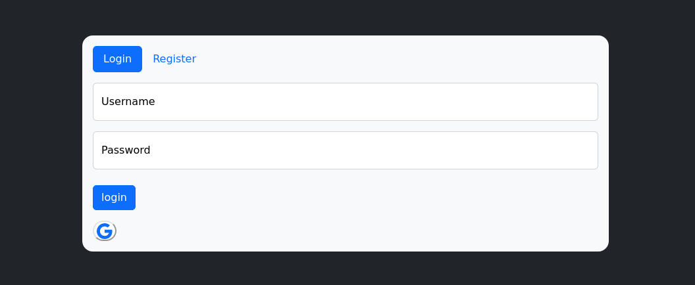
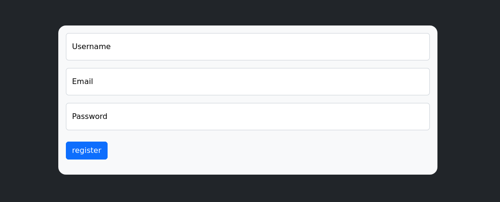
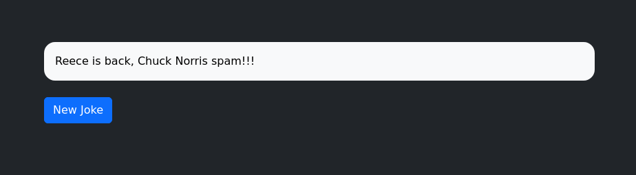

# Simple Login OAuth2 Google with Django framework

## About

A simple login page, made with the Django web framework, using Google's OAuth2 through the social-django library, I've created a way to register users as well. Once the user has logged in, they will be redirected to the main page where they will be presented with Chuck Norris jokes from the Chuck Norris Jokes API.

PS: localhost only

| Login | Create a User | Home |
|-------|---------------|------|
|||

## Tools
- **[Django](https://www.djangoproject.com/)**: Web framework
- **[Python3](https://www.python.org/)**: Programming language Python3
- **[Chuck Norris Jokes](https://api.chucknorris.io/)**: API
- **[Google Console](https://console.cloud.google.com/apis/credentials)**: Create your credencials OAuth2

## Dependencies

- Clone this project:
```bash
$ git clone https://github.com/HenriqueStocco/simple-login-django.git
```

- Setup virtual environment
```bash
$ python3 -m venv venv (linux)

$ source venv/bin/activate (linux)
```

- Install dependencies :
```bash
$(venv) pip install -r requirements.txt
```

- Change .env-example with as your django `secret_key` settings.py, `social_auth_google_oauth2_key` and `social_auth_google_oauth2_secret`

- Create your Super User:
```bash
$(venv) cd website

$(venv) python3 manage.py createsuperuser
```

- Make migration:
```bash
$(venv) python3 manage.py makemigrations
```
- Migrate:
```bash
$(venv) python3 manage.py migrate
```

- Run server:
```bash
$(venv) python3 manage.py runserver
```

- In home page, touch the button for generate a new jokes